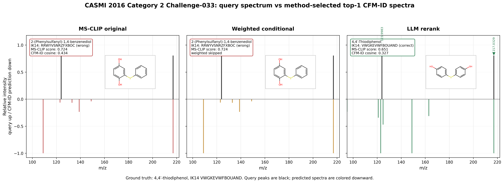

# Case 2: CASMI 2016 Category 2 Challenge-033

## Why this case
This is a second LLM rescue example with a different failure mode from `Challenge-095`: the weighted conditional arm skipped reranking because MS-CLIP appeared high-confidence, but MS-CLIP was wrong. The LLM recovered the ground truth from the top-5 using a diaryl-sulfide fragmentation argument.

## Ground Truth
- Spectrum: `Challenge-033`
- Dataset: CASMI 2016 category 2
- Formula: `C12H10O2S`
- Precursor m/z: `217.0329`
- Ion mode / adduct: `negative` / `[M-H]-`
- GT InChIKey first block: `VWGKEVWFBOUAND`
- GT SMILES: `OC1=CC=C(SC2=CC=C(O)C=C2)C=C1`
- Experimental peaks after normalization: `2` peaks

## Top-1 Outcomes
| method | selected name | selected IK14 | selected SMILES | score | correct? | note |
|---|---|---|---|---:|---|---|
| MS-CLIP original | 2-(Phenylsulfanyl)-1,4-benzenediol | `RRWYVSNRZFXBOC` | `S(c1ccccc1)c2cc(O)ccc2O` | 0.7243 | False |  |
| Weighted conditional | 2-(Phenylsulfanyl)-1,4-benzenediol | `RRWYVSNRZFXBOC` | `S(c1ccccc1)c2cc(O)ccc2O` | 0.7243 | False | skipped: msclip_high_confidence_skip (top1=0.724, gap=0.068) |
| LLM reranked | 4,4′-Thiodiphenol | `VWGKEVWFBOUAND` | `c1cc(ccc1O)Sc2ccc(cc2)O` | 0.6509 | True |  |

## Top-5 Candidate Evidence
`LLM input index` is after the reconstructed CFM-ID rerank step; for this case the GT remains input index 3.

| primary rank | LLM input index | candidate | IK14 | MS-CLIP | CFM-ID cosine | evidence score | CFM-ID rank | LLM rank |
|---:|---:|---|---|---:|---:|---:|---:|---:|
| 1 | 0 | 2-(Phenylsulfanyl)-1,4-benzenediol | `RRWYVSNRZFXBOC` | 0.724 | 0.4344 | 0.6200 | 1 | 2 |
| 2 | 4 | O-Methyl O-2-naphthyl carbonothioate | `ZKMHCMSEUXUZMX` | 0.656 | 0.1303 | 0.5014 | 5 | 5 |
| 3 | 2 | 2-(Phenylsulfinyl)phenol | `LHYFMWGDNOTXEL` | 0.653 | 0.3417 | 0.5637 | 3 | 4 |
| 4 | 3 | 4,4′-Thiodiphenol | `VWGKEVWFBOUAND` | 0.651 | 0.3273 | 0.5586 | 4 | 1 |
| 5 | 1 | 1,1'-[Sulfanediylbis(oxy)]dibenzene | `JHYBWOJWPAOJDQ` | 0.641 | 0.4424 | 0.5890 | 2 | 3 |

## Spectrum Comparison Figure


## CFM-ID Simulation
CFM-ID evidence was reconstructed with the same reranker code path. The original weighted conditional run skipped SIRIUS/CFM-ID for this spectrum, so these CFM-ID values are reconstructed for analysis rather than copied from the weighted JSONL.

| method-selected molecule | CFM-ID cache hit | CFM-ID cosine | model |
|---|---:|---:|---|
| MS-CLIP original: 2-(Phenylsulfanyl)-1,4-benzenediol | True | 0.4344 | `cfm-id-4.4.7` |
| Weighted conditional: 2-(Phenylsulfanyl)-1,4-benzenediol | True | 0.4344 | `cfm-id-4.4.7` |
| LLM rerank: 4,4′-Thiodiphenol | True | 0.3273 | `cfm-id-4.4.7` |

## LLM Rerank Report
- LLM selected IK14: `VWGKEVWFBOUAND`
- Correct: `True`
- Confidence: `medium`
- Fallback used: `False`
- Parse error: `None`
- LLM ranked indices over CFM-ID-reranked input: `[3, 0, 1, 2, 4]`

```text
Spectrum Challenge-033 (precursor m/z 217.0329).
Selected top-1: c1cc(ccc1O)Sc2ccc(cc2)O (confidence: medium).
Justification: The diagnostic base peak at m/z 123.9983 corresponds exactly to [C6H4OS]•- (calc. 123.9983), requiring a neutral loss of 93.0346 Da = C6H5O• (phenoxy radical) from the [M-H]- at 217.0329. Only 4,4'-thiodiphenol (index 3) cleanly produces this ion via symmetric homolytic C–S cleavage of a hydroxyphenyl radical, whereas candidate 0's CFM-ID predicts its base peak at m/z 109.0117 (thiophenolate, CFM cosine 0.4344) with no prediction at 123.99, and candidates 1/2/4 lack CFM-predicted peaks consistent with 123.9983. SIRIUS provided no top-1 formula for any candidate, so selection rests on mechanistic fit to the phenoxy-loss channel that is structurally trivial only for the para,para'-thiodiphenol scaffold.
Peak-level claims:
  - m/z 217.0329 corresponds to fragment of [M-H]- of C12H10O2S (4,4'-thiodiphenol)
  - m/z 123.9983 corresponds to loss of C6H5O radical (phenoxy, 93.0346 Da) from [M-H]-
  - m/z 123.9983 corresponds to fragment [C6H4OS]•- arising from homolytic C–S cleavage of the diaryl sulfide
```

## Claim Sanity Check
- `m/z 123.9983` is consistent with `[C6H4OS]•-`.
- Complementary neutral loss from the deprotonated precursor is approximately `C6H5O•`, matching the LLM explanation.
- The claim is chemically plausible for homolytic C-S cleavage in a diaryl sulfide scaffold.

## Source Files
- MS-CLIP original: `data/eval/casmi/2016_cat2_msclip_only/casmi_identifications.jsonl:33`
- Weighted conditional result: `data/eval/casmi/2016_cat2_conditional/casmi_identifications.jsonl:33`
- LLM reranked result: `data/eval/casmi/2016_cat2_llm_reranker/casmi_identifications.jsonl:33`
