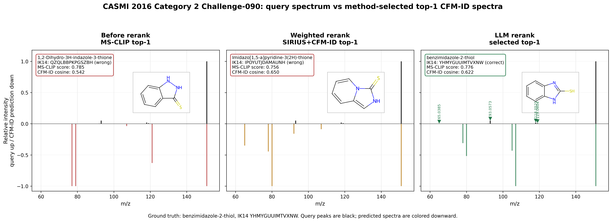

# Case 1: CASMI 2016 Category 2 Challenge-090

## Why this case
This is a clean LLM rescue example: MS-CLIP selects the wrong top-1, the weighted SIRIUS+CFM-ID reranker also selects a wrong top-1, while the LLM reranker selects the ground-truth InChIKey first block.

## Ground Truth
- Spectrum: `Challenge-090`
- Dataset: CASMI 2016 category 2
- Formula: `C7H6N2S`
- Precursor m/z: `151.0324`
- Ion mode / adduct: `positive` / `[M+H]+`
- GT InChIKey first block: `YHMYGUUIMTVXNW`
- GT SMILES: `SC1=NC2=CC=CC=C2N1`
- Experimental peaks after normalization: `7` peaks

## Top-1 Outcomes
| method | selected name | selected IK14 | selected SMILES | score | correct? |
|---|---|---|---|---:|---|
| MS-CLIP original | 1,2-Dihydro-3H-indazole-3-thione | `QZQLBBPKPGSZBH` | `c1ccc2c(c1)c(=S)[nH][nH]2` | 0.7850 | False |
| Weighted SIRIUS+CFM-ID | Imidazo[1,5-a]pyridine-3(2H)-thione | `IPOYUTJDAMAUNH` | `c1ccn2c(c1)c[nH]c2=S` | 0.7557 | False |
| LLM reranked | benzimidazole-2-thiol | `YHMYGUUIMTVXNW` | `c1ccc2c(c1)[nH]c(n2)S` | 0.7764 | True |

## Top-5 Candidate Evidence
| primary rank | candidate | IK14 | MS-CLIP | CFM-ID cosine | weighted evidence | weighted rank | LLM rank |
|---:|---|---|---:|---:|---:|---:|---:|
| 1 | 1,2-Dihydro-3H-indazole-3-thione | `QZQLBBPKPGSZBH` | 0.785 | 0.5417 | 0.6765 | 3 | 2 |
| 2 | benzimidazole-2-thiol | `YHMYGUUIMTVXNW` | 0.776 | 0.6216 | 0.6970 | 2 | 1 |
| 3 | 2-Aminobenzothiazole | `UHGULLIUJBCTEF` | 0.771 | 0.5588 | 0.6759 | 4 | 4 |
| 4 | Imidazo[1,5-a]pyridine-3(2H)-thione | `IPOYUTJDAMAUNH` | 0.756 | 0.6501 | 0.6973 | 1 | 3 |
| 5 | 2-Methyl[1,3]thiazolo[5,4-b]pyridine | `NVXPSQIYZCKHMN` | 0.740 | 0.4815 | 0.6405 | 5 | 5 |

## CFM-ID Simulation
The reconstructed CFM-ID evidence used the same code path as the weighted reranker. All five top-5 candidate predictions were cache hits from `data/cache/cfmid`; model version reported by the cache is `cfm-id-4.4.7`.



Top-1 MS-CLIP candidate CFM-ID predicted peaks:

| m/z | intensity |
|---:|---:|
| 77.03858 | 1.0000 |
| 79.05423 | 1.0000 |
| 107.06037 | 0.0367 |
| 121.01065 | 0.6297 |
| 151.03245 | 1.0000 |

SIRIUS reconstruction status:

```text
SiriusNotInstalledError: SIRIUS is installed but this build requires login before running formula trees: Login ERROR: Please Login to use the SIRIUS command line tool!
Usage: sirius login [-hV] [--clear] [--limits] [--request-token-only] [--show]
                    [--select-license=<sid>] [[-u=<username> -p] |
                    [--token=<token>] | [--user-env=<username>
                    --password-env=<password>]]
<STANDALONE> Allows a user to login for SIRIUS Webservices (e.g. CSI:FingerID
or CANOPUS) and securely store a personal access token.


      --clear, --logout      Logout. Deletes
```

Interpretation: the case package contains CFM-ID simulation results. The original CASMI weighted JSONL retained the final weighted choice and gate decision, but not the full SIRIUS tree or per-candidate weighted evidence; the current local SIRIUS CLI also requires login, so SIRIUS evidence cannot be faithfully reconstructed from disk alone.

## LLM Rerank Report
- LLM selected IK14: `YHMYGUUIMTVXNW`
- Correct: `True`
- Confidence: `medium`
- Fallback used: `False`
- Parse error: `None`
- LLM ranked indices over the original top-5: `[1, 0, 3, 2, 4]`

```text
Spectrum Challenge-090 (precursor m/z 151.0324).
Selected top-1: c1ccc2c(c1)[nH]c(n2)S (confidence: medium).
Justification: Benzimidazole-2-thiol (index 1) carries the highest MS-CLIP score (0.776) and a CFM-ID cosine of 0.6216 against the experimental spectrum. The experimental peaks at 118.0525 and 119.0604 correspond to characteristic losses of SH (−32.98 Da) and S (−31.97 Da) from the free thiol group, which are diagnostic for 2-mercaptobenzimidazole-type structures. The fragment at 93.0573 (C6H7N+) is consistent with ring-opening loss of COS (57.98 Da) from the bicyclic system, and the peak at 65.0385 matches the cyclopentadienyl/pyridinium fragment C5H5+ (65.039), further supporting a benzimidazole scaffold.
Peak-level claims:
  - m/z 118.0525 corresponds to loss of SH (32.980 Da) from precursor [M+H]+ at 151.0324
  - m/z 119.0604 corresponds to loss of S (31.972 Da) from precursor [M+H]+ at 151.0324
  - m/z 93.0573 corresponds to loss of COS (57.975 Da) from precursor [M+H]+ at 151.0324, yielding C6H7N+
  - m/z 65.0385 corresponds to fragment of C5H5+ arising from retro-cycloaddition of the benzimidazole ring
```

## Source Files
- MS-CLIP original: `data/eval/casmi/2016_cat2_msclip_only/casmi_identifications.jsonl:90`
- Weighted result: `data/eval/casmi/2016_cat2_conditional/casmi_identifications.jsonl:90`
- LLM reranked result: `data/eval/casmi/2016_cat2_llm_reranker/casmi_identifications.jsonl:90`
- Report context: `reports/eval/casmi_2016_cat2_v1.md`, `reports/eval/casmi_ood_v1.md`, `reports/eval/llm_reranker_v2.md`
