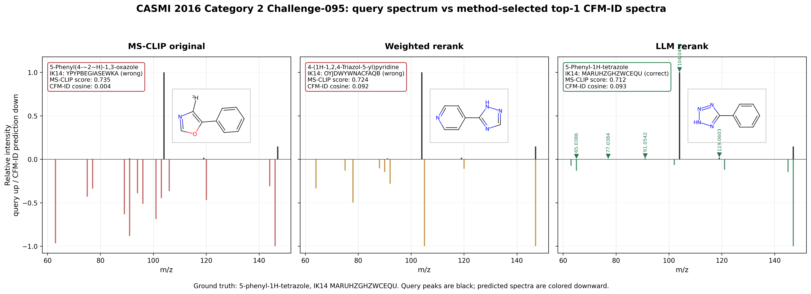

# Case 1: CASMI 2016 Category 2 Challenge-095

## Why this case
This is a cleaner replacement for `Challenge-090`: MS-CLIP and weighted reranking both miss the ground truth, while the LLM reranker selects the correct 5-phenyl-1H-tetrazole. The LLM peak-level explanation passes basic mass and element sanity checks for the dominant tetrazole losses.

## Ground Truth
- Spectrum: `Challenge-095`
- Dataset: CASMI 2016 category 2
- Formula: `C7H6N4`
- Precursor m/z: `147.0665`
- Ion mode / adduct: `positive` / `[M+H]+`
- GT InChIKey first block: `MARUHZGHZWCEQU`
- GT SMILES: `N1N=NN=C1C1=CC=CC=C1`
- Experimental peaks after normalization: `10` peaks

## Top-1 Outcomes
| method | selected name | selected IK14 | selected SMILES | score | correct? |
|---|---|---|---|---:|---|
| MS-CLIP original | 5-Phenyl(4-~2~H)-1,3-oxazole | `YPYPBEGIASEWKA` | `[2H]c2ncoc2c1ccccc1` | 0.7351 | False |
| Weighted SIRIUS+CFM-ID | 4-(1H-1,2,4-Triazol-5-yl)pyridine | `OYJDWYWNACFAQB` | `c1cnccc1c2[nH]ncn2` | 0.7237 | False |
| LLM reranked | 5-Phenyl-1H-tetrazole | `MARUHZGHZWCEQU` | `c1ccc(cc1)c2n[nH]nn2` | 0.7124 | True |

## Top-5 Candidate Evidence
`LLM input index` is after the CFM-ID rerank step; it is not the same as the original MS-CLIP primary rank.

| primary rank | LLM input index | candidate | IK14 | MS-CLIP | CFM-ID cosine | evidence score | CFM-ID rank | LLM rank |
|---:|---:|---|---|---:|---:|---:|---:|---:|
| 1 | 4 | 5-Phenyl(4-~2~H)-1,3-oxazole | `YPYPBEGIASEWKA` | 0.735 | 0.0039 | 0.2952 | 5 | 5 |
| 2 | 0 | 4-(1H-1,2,4-Triazol-5-yl)pyridine | `OYJDWYWNACFAQB` | 0.724 | 0.0919 | 0.5171 | 1 | 2 |
| 3 | 1 | 4-(4H-1,2,4-Triazol-4-yl)pyridine | `HGBIXRBWIWLVML` | 0.723 | 0.0863 | 0.5150 | 2 | 3 |
| 4 | 2 | 5-Phenyl-1H-tetrazole | `MARUHZGHZWCEQU` | 0.712 | 0.0931 | 0.5129 | 3 | 1 |
| 5 | 3 | 4-(1H-Pyrazol-4-yl)pyrimidine | `XHWTWNCQBNQUDK` | 0.712 | 0.0832 | 0.5098 | 4 | 4 |

## Spectrum Comparison Figure


## CFM-ID / SIRIUS Simulation
CFM-ID evidence was reconstructed with the same reranker code path. The selected top-1 CFM-ID cosines are:

| method-selected molecule | CFM-ID cache hit | CFM-ID cosine | model |
|---|---:|---:|---|
| MS-CLIP original: 5-Phenyl(4-~2~H)-1,3-oxazole | True | 0.0039 | `cfm-id-4.4.7` |
| Weighted rerank: 4-(1H-1,2,4-Triazol-5-yl)pyridine | True | 0.0919 | `cfm-id-4.4.7` |
| LLM rerank: 5-Phenyl-1H-tetrazole | True | 0.0931 | `cfm-id-4.4.7` |

SIRIUS reconstruction status:

```text
SiriusNotInstalledError: SIRIUS is installed but this build requires login before running formula trees: Login ERROR: Please Login to use the SIRIUS command line tool!
Usage: sirius login [-hV] [--clear] [--limits] [--request-token-only] [--show]
                    [--select-license=<sid>] [[-u=<username> -p] |
                    [--token=<token>] | [--user-env=<username>
                    --password-env=<password>]]
<STANDALONE> Allows a user to login for SIRIUS Webservices (e.g. CSI:FingerID
or CANOPUS) and securely store a personal access token.


      --clear, --logout      Logout. Deletes
```

The original weighted run selected `4-(1H-1,2,4-Triazol-5-yl)pyridine`. The stored JSONL does not preserve the full original SIRIUS tree or per-candidate evidence table, so this package includes reconstructed CFM-ID evidence plus the current SIRIUS status.

## LLM Rerank Report
- LLM selected IK14: `MARUHZGHZWCEQU`
- Correct: `True`
- Confidence: `high`
- Fallback used: `False`
- Parse error: `None`
- LLM ranked indices over CFM-ID-reranked input: `[2, 0, 1, 3, 4]`

```text
Spectrum Challenge-095 (precursor m/z 147.0665).
Selected top-1: c1ccc(cc1)c2n[nH]nn2 (confidence: high).
Justification: Candidate 2 (5-phenyl-1H-tetrazole) uniquely explains the dominant fragmentation pattern: the base peak at m/z 104.0494 corresponds to loss of HN3 (43.0171 Da) yielding the benzonitrile cation C7H6N+ (104.0495), the diagnostic signature of 5-aryltetrazoles, and m/z 77.0384 matches the phenyl cation C6H5+ (77.0386) which requires a free phenyl group not present in the pyridyl/pyrimidinyl candidates 0, 1, and 3. CFM-ID cosine of 0.0931 is the highest among the mass-matched C7H6N4 isomers, and candidate 4 is rejected on mass (C9H7NO, mass_match=0).
Peak-level claims:
  - m/z 104.0494 corresponds to loss of HN3 (hydrazoic acid, 43.0171 Da) from [M+H]+ giving benzonitrile cation C7H6N+
  - m/z 119.0603 corresponds to loss of N2 (28.0062 Da) from [M+H]+
  - m/z 77.0384 corresponds to fragment of C6H5+ phenyl cation from the phenyl ring
  - m/z 91.0542 corresponds to fragment of C7H7+ (tropylium-like) arising from the phenyl-C=N unit after ring rearrangement
  - m/z 65.0386 corresponds to fragment of C5H5+ from loss of C2H2 from the phenyl cation
```

## Claim Sanity Check
- `147.0665 - 104.0494 = 43.0171 Da`, matching HN3 loss from a tetrazole.
- `147.0665 - 119.0603 = 28.0062 Da`, matching N2 loss.
- `m/z 77.0384` is consistent with the phenyl cation `C6H5+`.

## Source Files
- MS-CLIP original: `data/eval/casmi/2016_cat2_msclip_only/casmi_identifications.jsonl:95`
- Weighted result: `data/eval/casmi/2016_cat2_conditional/casmi_identifications.jsonl:95`
- LLM reranked result: `data/eval/casmi/2016_cat2_llm_reranker/casmi_identifications.jsonl:95`
- Report context: `reports/eval/casmi_2016_cat2_v1.md`, `reports/eval/casmi_ood_v1.md`, `reports/eval/llm_reranker_v2.md`
